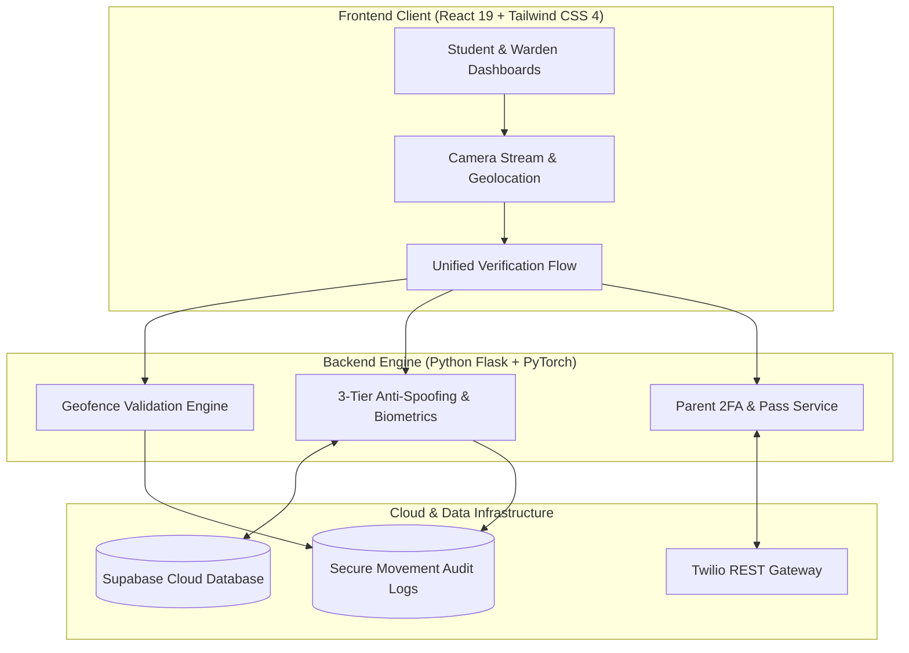

<div align="center">

  

  # IntelliSentry
  ### Intelligent Multi-Factor Hostel Access & Safety Monitoring Platform

  An enterprise-grade campus security solution integrating multi-factor biometric authentication, geodesic geofencing, real-time curfew automation, and parental two-factor SMS verification.

  <p align="center">
    <a href="https://intellisentry.vercel.app" target="_blank" rel="noopener noreferrer">
      
    </a>
    
    <a href="https://github.com/Hashimmalik46/IntelliSentry/stargazers" target="_blank" rel="noopener noreferrer">
      
    </a>
    <a href="#license">
      
    </a>
    
    
  </p>

  <p align="center">
    <a href="#-key-features"><b>✨ Features</b></a> &nbsp;•&nbsp;
    <a href="#-core-architecture"><b>🧬 Architecture</b></a> &nbsp;•&nbsp;
    <a href="#-security-framework"><b>🛡️ Security</b></a> &nbsp;•&nbsp;
    <a href="#-tech-stack"><b>💻 Tech Stack</b></a> &nbsp;•&nbsp;
    <a href="#-user-portals"><b>👥 Portals</b></a> &nbsp;•&nbsp;
    <a href="#-getting-started"><b>🚀 Quick Start</b></a>
  </p>

</div>

---

## 📌 Table of Contents

- [Overview](#-overview)
- [Key Features](#-key-features)
- [Core Architecture](#-core-architecture)
- [Multi-Tier Security Framework](#-multi-tier-security-framework)
  - [1. Deep Metric Biometric AI & Anti-Spoofing](#1-deep-metric-biometric-ai--anti-spoofing)
  - [2. Dual Geofencing Spatial Engine](#2-dual-geofencing-spatial-engine)
  - [3. Parent 2FA Verification & Leave Pass Engine](#3-parent-2fa-verification--leave-pass-engine)
  - [4. Dynamic Curfew & Emergency Protocols](#4-dynamic-curfew--emergency-protocols)
- [User Roles & Portals](#-user-roles--portals)
- [Tech Stack](#-tech-stack)
- [Repository Structure](#-repository-structure)
- [Getting Started](#-getting-started)
- [License & Attribution](#-license--attribution)

---

## 📖 Overview

**IntelliSentry** is a next-generation residential safety and access monitoring platform designed to eliminate the vulnerabilities of traditional hostel register logs, RFID card proxies, and unverified out-of-campus movements.

By synchronizing **spatial GPS boundaries**, **deep biometric facial metric learning**, **presentation attack anti-spoofing**, **automated parent 2FA SMS approvals**, and **dynamic curfew guardrails**, IntelliSentry establishes a zero-trust access ecosystem tailored for modern university residential campuses.

```
       ┌──────────────────┐
       │ Student at Gate  │
       └────────┬─────────┘
                │
         [Step 1: Geofence]
     GPS Location Radius Check
                │
                ▼
        [Step 2: Biometrics]
     Anti-Spoof Liveness + Face AI
                │
                ▼
        [Step 3: Verification]
    Curfew & Leave Pass 2FA Engine
                │
                ▼
  ┌─────────────────────────────┐
  │ ✅ AUTHORIZED GATE MOVEMENT  │
  └─────────────────────────────┘
```

---

## ✨ Key Features

- **🌐 Dual Spatial Geofencing**: Validates physical presence via spherical great-circle radial calculations and polygon ray-casting.
- **🧬 Deep Metric Facial Recognition**: High-precision metric embedding pipeline utilizing custom deep residual networks with additive angular margin loss.
- **🛡️ 3-Tier Presentation Attack Defense**: Multi-spectral liveness detection detecting printouts, grayscale photocopies, and digital display glares.
- **📱 2FA Parent SMS Verification**: Real-time pass approval workflow dispatching single-use cryptographic tokens and 6-digit OTP verification via Twilio.
- **⏰ Dynamic Curfew Automation**: Centralized curfew engine with real-time countdown alerts, pre-curfew warnings, and automated movement lockouts.
- **🚨 Warden Emergency Clearances**: Dedicated administrative override mechanisms for authorized emergency inbound/outbound movements.
- **👥 Role-Based Access Control**: Multi-tenant architecture isolating Student actions from Warden administration and Master Headcount audits.
- **📊 Real-Time Audit Logs**: Centralized activity monitoring with custom date ranges, movement filters, and one-click security report exports.

---

## 🏗️ Core Architecture



---

## 🛡️ Multi-Tier Security Framework

```
                  ┌─────────────────────────────────────┐
                  │    IntelliSentry Multi-Factor AI    │
                  └──────────────────┬──────────────────┘
                                     │
     ┌───────────────────────────────┼───────────────────────────────┐
     ▼                               ▼                               ▼
┌─────────────────────────┐ ┌─────────────────────────┐ ┌─────────────────────────┐
│     Spatial Geofence    │ │      Biometric AI       │ │    Parent 2FA & Curfew  │
├─────────────────────────┤ ├─────────────────────────┤ ├─────────────────────────┤
│ • Geodesic Radius Check │ │ • Anti-Spoof Liveness   │ │ • Single-Use SMS Tokens │
│ • Polygon Ray-Casting   │ │ • Deep Metric Embeddings│ │ • 6-Digit OTP Validation│
│ • Anti-Location Spoof   │ │ • Fault-Tolerant Engine │ │ • Dynamic Gate Lockouts │
└─────────────────────────┘ └─────────────────────────┘ └─────────────────────────┘
```

### 1. Deep Metric Biometric AI & Anti-Spoofing
- **Metric Embedding Model**: Custom deep residual architecture generating compact normalized embedding vectors for rapid cosine similarity matching.
- **Liveness & Presentation Attack Detection**:
  - *Edge Variance Filter*: Screens for static low-resolution or blurred printout attacks.
  - *Color Saturation Analysis*: Detects monochromatic and grayscale photocopies.
  - *Frequency Spectrum Moiré Analysis*: Detects digital screen glare, pixel grids, and monitor displays.
- **Multi-Engine Redundancy**: Fault-tolerant cascade ensuring high availability across edge environments and CPU fallbacks.

### 2. Dual Geofencing Spatial Engine
- **Radial Geodesic Distance**: Enforces strict physical distance boundaries relative to campus coordinates using the Haversine spherical distance model.
- **Planar Boundary Validation**: Evaluates non-circular campus perimeter geometries via metric coordinate projection and topological ray-casting containment.

### 3. Parent 2FA Verification & Leave Pass Engine
- **Cryptographic Request Links**: Outbound home leave passes dispatch single-use, time-limited approval URLs directly to verified parental contacts.
- **6-Digit OTP Layer**: Parents verify authorization via an interactive SMS OTP flow with automated expiration and brute-force attempt limits.
- **Warden Final Review**: Dual-stage approval ensuring parental confirmation prior to administrative gate pass issuance.

### 4. Dynamic Curfew & Emergency Protocols
- **Real-Time Curfew Synchronization**: Dynamic policy updates broadcast across student portals and gate monitors.
- **Pre-Curfew Warning Alerts**: Visual countdown notifications for residents outside premises approaching curfew deadlines.
- **Warden Emergency Overrides**: Restricted supervisory clearance tools for urgent medical or emergency departures during curfew hours.

---

## 👥 User Roles & Portals

| Portal | Target Audience | Primary Capabilities |
| :--- | :--- | :--- |
| **Student Portal** | Hostel Residents | Biometric gate scans, leave pass requests, curfew countdowns, movement history. |
| **Admin Dashboard** | Wardens & Security | Master resident headcounts, dynamic curfew controls, overdue alerts, emergency overrides. |
| **Onboarding Portal** | Housing Administrators | Student account activation, room & hostel allocations, verified contact linkage. |
| **Pass Management** | Wardens | Review 2FA parent-verified passes, grant final authorizations, track active passes. |
| **Activity Audit** | Campus Security | Comprehensive gate movement audit logs, date filters, security CSV exports. |
| **Parent Portal** | Parents / Guardians | Mobile-friendly 2FA OTP review portal for outbound student leave authorization. |

---

## 💻 Tech Stack

<div align="center">

### Frontend
<p align="center">
  
  
  
  
  
</p>

### Backend & Machine Learning
<p align="center">
  
  
  
  
  
  
</p>

### Cloud & Database
<p align="center">
  
  
  
  
</p>

</div>

---

## 📁 Repository Structure

```
IntelliSentry/
├── client/                     # Frontend React 19 Application (Vite + Tailwind CSS)
│   ├── src/
│   │   ├── components/         # Verification modals, camera capture, responsive layout
│   │   ├── pages/              # Dashboards, onboarding, passes, activity logs
│   │   └── utils/              # Dynamic curfew & geolocation utilities
│   ├── public/                 # Static branding assets & web worker models
│   └── package.json
│
├── server/                     # Backend Python API & ML Inference Engine
│   ├── weights/                # Pre-trained deep biometric model checkpoints
│   ├── app.py                  # API service routes & security controllers
│   ├── face_service.py         # Biometric metric embedding & anti-spoofing pipeline
│   ├── sms_service.py          # Twilio SMS 2FA & OTP verification service
│   ├── haversine_check.py      # Spatial geodesic distance calculator
│   ├── pip_check.py            # Polygonal boundary verification engine
│   └── requirements.txt
│
└── README.md
```

---

## 🚀 Getting Started

### Prerequisites
- **Node.js**: `v18.x` or higher
- **Python**: `v3.10` – `v3.12`
- **Supabase**: PostgreSQL database instance
- **Twilio**: SMS API credentials

---

### Step 1: Clone Repository
```bash
git clone https://github.com/Hashimmalik46/IntelliSentry.git
cd IntelliSentry
```

---

### Step 2: Backend Setup
```bash
cd server
python -m venv .venv

# Activate Virtual Environment (Windows / Linux)
.venv\Scripts\activate       # Windows
# source .venv/bin/activate  # Linux / macOS

pip install -r requirements.txt
python app.py
```
*Backend runs on `http://127.0.0.1:5000`.*

---

### Step 3: Frontend Setup
```bash
cd ../client
npm install
npm run dev
```
*Frontend runs on `http://localhost:5173`.*

---

## 📄 License & Attribution

This project is licensed under the **MIT License** — see the `LICENSE` file for details.

Developed for the **Department of Computer Science & Engineering**, **Islamic University of Science & Technology (IUST)**.

---

<div align="center">
  <sub>Built with ❤️ for Campus Safety and Modern Residential Security.</sub>
</div>
