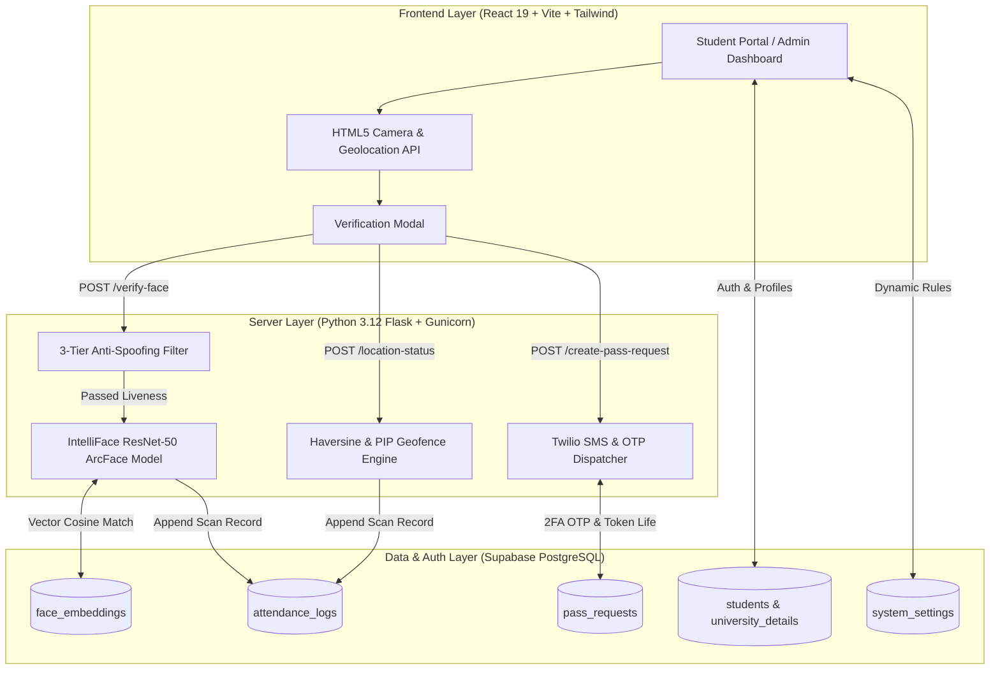
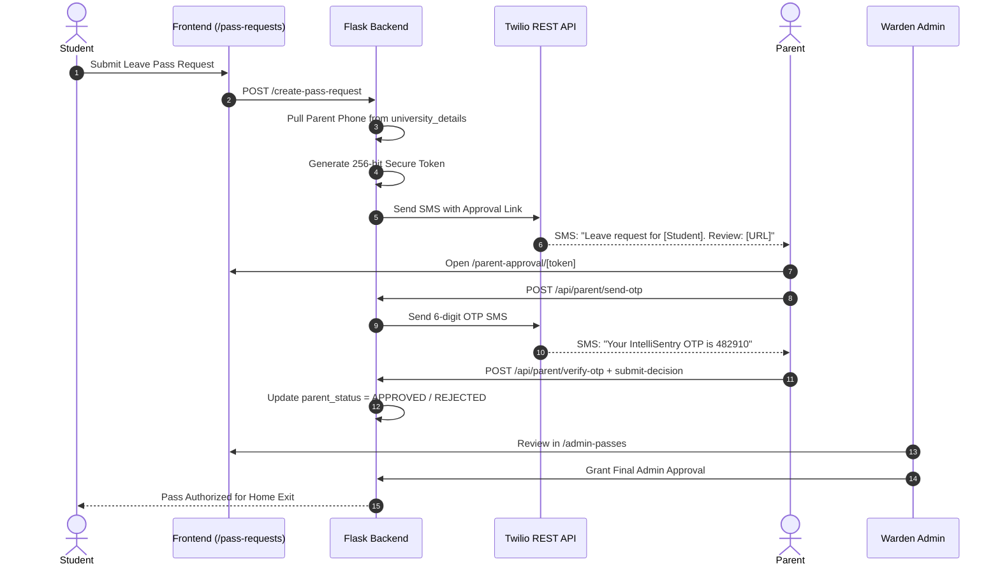
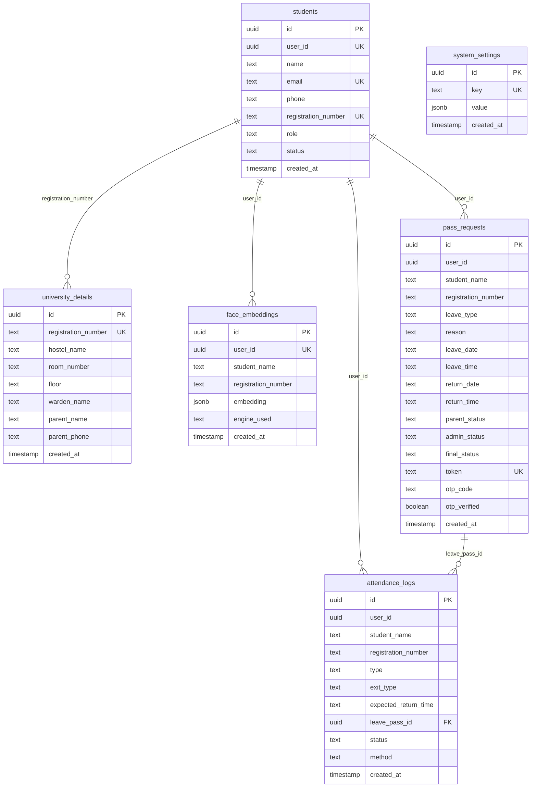

<div align="center">

  

  # IntelliSentry
  ### AI-Driven Multi-Factor Hostel Access Control & Safety Monitoring System

  A multi-layered campus security & residential monitoring platform combining GPS geofencing, deep metric facial recognition (ResNet-50 ArcFace), 3-tier presentation attack anti-spoofing, parent 2FA SMS verification, and dynamic curfew management.

  <p align="center">
    <a href="https://intellisentry.vercel.app" target="_blank" rel="noopener noreferrer">
      
    </a>
    
    <a href="https://github.com/Hashimmalik46/IntelliSentry/stargazers" target="_blank" rel="noopener noreferrer">
      
    </a>
    <a href="#license">
      
    </a>
    
    
  </p>

  <p align="center">
    <a href="#-key-features"><b>✨ Features</b></a> &nbsp;•&nbsp;
    <a href="#-multi-tier-ai-biometric-pipeline"><b>🧬 Biometric AI</b></a> &nbsp;•&nbsp;
    <a href="#-dual-geofencing-verification-engine"><b>📍 Geofencing</b></a> &nbsp;•&nbsp;
    <a href="#-parent-2fa-sms--otp-authorization"><b>📱 Parent 2FA</b></a> &nbsp;•&nbsp;
    <a href="#-tech-stack"><b>💻 Tech Stack</b></a> &nbsp;•&nbsp;
    <a href="#-installation--local-setup"><b>🚀 Quick Start</b></a> &nbsp;•&nbsp;
    <a href="#-database-schema"><b>🗄️ Database</b></a> &nbsp;•&nbsp;
    <a href="#-api-route-registry"><b>🔌 API</b></a>
  </p>

</div>

---

## 📌 Table of Contents

- [Overview & Vision](#-overview--vision)
- [Key Features](#-key-features)
- [Tech Stack](#-tech-stack)
- [System Architecture & Flow](#-system-architecture--flow)
- [Multi-Tier AI Biometric Pipeline](#-multi-tier-ai-biometric-pipeline)
  - [1. Custom IntelliFace ArcFace Backbone](#1-custom-intelliface-arcface-backbone-intellifacepth)
  - [2. Multi-Engine Routing Hierarchy & DeepFace Fallbacks](#2-multi-engine-routing-hierarchy--deepface-fallbacks)
  - [3. Enhanced 3-Tier Anti-Spoofing & Liveness Engine](#3-enhanced-3-tier-anti-spoofing--liveness-engine)
- [Dual Geofencing Verification Engine](#-dual-geofencing-verification-engine)
  - [1. Stage 1: Haversine Great-Circle Radial Engine](#1-stage-1-haversine-great-circle-radial-engine-haversine_checkpy)
  - [2. Stage 2: Point-in-Polygon (PIP) Ray-Casting](#2-stage-2-point-in-polygon-pip-ray-casting-pip_checkpy)
  - [3. Frontend Geolocation Integration & Developer Bypass](#3-frontend-geolocation-integration--developer-bypass)
- [Parent 2FA SMS & OTP Authorization](#-parent-2fa-sms--otp-authorization)
- [Dynamic Curfew Engine & Warden Emergency Overrides](#-dynamic-curfew-engine--warden-emergency-overrides)
- [User Roles & Portal Capabilities](#-user-roles--portal-capabilities)
- [Database Schema](#-database-schema)
- [API Route Registry](#-api-route-registry)
- [Repository File Structure](#-repository-file-structure)
- [Installation & Local Setup](#-installation--local-setup)
- [Environment Configuration](#-environment-configuration)
- [Deployment Guide](#-deployment-guide)
- [License & Academic Attribution](#-license--academic-attribution)

---

## 📖 Overview & Vision

Traditional campus and hostel security frameworks rely heavily on manual paper registers, static RFID cards, and unverified phone communications. These legacy methods are vulnerable to **proxy attendance, gate log falsification, photo printout presentation attacks, and delayed emergency parental notification**.

**IntelliSentry** resolves these vulnerabilities through a cloud-native, multi-layered zero-trust safety framework. By combining **geodesic GPS coordinate boundaries**, **deep convolutional metric learning (ArcFace ResNet-50)**, **multi-spectral presentation attack detection**, **cryptographic 2FA parent SMS authorization**, and a **dynamic curfew engine**, IntelliSentry provides automated, tamper-evident residential monitoring for modern smart campuses.

```
       ┌──────────────────┐
       │ Student at Gate  │
       └────────┬─────────┘
                │
         [Step 1: Geofence]
    Haversine (<500m) & 4-Corner PIP
                │
                ▼
        [Step 2: Biometrics]
   3-Tier Anti-Spoof + ArcFace AI
                │
                ▼
        [Step 3: Verification]
    Curfew & Leave Pass 2FA Engine
                │
                ▼
  ┌─────────────────────────────┐
  │ ✅ AUTHORIZED GATE MOVEMENT  │
  └─────────────────────────────┘
```

---

## ✨ Key Features

- **🌐 Dual-Engine Geofence Validation**: Haversine radial distance calculation ($\le 500\text{m}$) + 4-point Point-in-Polygon (PIP) ray-casting against IUST campus boundaries.
- **🧬 IntelliFace Custom ArcFace AI**: PyTorch ResNet-50 backbone mapped to a 512-dimensional unit hypersphere, trained on VGGFace2 (8,631 identities) achieving **99.80% verification accuracy**.
- **🛡️ 3-Tier Anti-Spoofing Engine**: Combined Laplacian variance edge checking, HSV color saturation detection, and 2D Fast Fourier Transform (FFT) moiré frequency spectrum analysis to defeat screen and printout attacks.
- **📱 Twilio Parent 2FA SMS & 6-Digit OTP**: End-to-end parent verification for out-of-campus home leave requests with 256-bit single-use tokens, 10-minute OTP expiration, and 5-attempt rate-limiting.
- **⏰ Dynamic Curfew Engine**: Real-time curfew policy synchronization (`system_settings`) with pre-curfew countdown warning banners, overdue tracking, and automated bidirectional lockout.
- **🚨 Warden Emergency Override System**: Exclusive administrative clearance portals allowing authorized wardens to override curfew locks for emergency departures or delayed arrivals.
- **👥 Role-Based Access Control (RBAC)**: Secure multi-tenant interface isolating Student workflows from Warden/Admin audit tools with responsive desktop sidebars and mobile 5-tab navigation.
- **🔒 Onboarding & Identity Collision Guards**: Pre-registration uniqueness checks for Registration IDs and emails with automatic uppercase normalization and cascading relational updates.

---

## 💻 Tech Stack

<div align="center">

### Frontend
<p align="center">
  
  
  
  
  
</p>

### Backend & Machine Learning
<p align="center">
  
  
  
  
  
  
</p>

### Cloud, Database & Communications
<p align="center">
  
  
  
  
</p>

</div>

---

## 🏗️ System Architecture & Flow



---

## 🧬 Multi-Tier AI Biometric Pipeline

IntelliSentry features a production-grade multi-engine biometric framework engineered in PyTorch and OpenCV. It prioritizes the custom-trained **IntelliFace ArcFace** deep model while offering an automated 4-tier fallback cascade and a 3-tier presentation attack defense filter.

```
                  ┌────────────────────────────────────────┐
                  │    Incoming Webcam Frame (Gate Scan)   │
                  └───────────────────┬────────────────────┘
                                      │
                                      ▼
             ┌──────────────────────────────────────────────────┐
             │       🛡️ 3-Tier Anti-Spoofing Liveness Check      │
             ├──────────────────────────────────────────────────┤
             │ Tier 1: Laplacian Variance (Edge / Blurry Print) │
             │ Tier 2: HSV Saturation (Grayscale Photocopy)     │
             │ Tier 3: 2D FFT Frequency (Screen / Moiré Glare)  │
             └────────────────────────┬─────────────────────────┘
                                      │  (Passed Liveness)
                                      ▼
             ┌──────────────────────────────────────────────────┐
             │         Dynamic Multi-Engine AI Hierarchy        │
             ├──────────────────────────────────────────────────┤
             │ 🥇 Primary: IntelliFace Custom ArcFace (512-D)    │
             │ 🥈 Secondary: DeepFace ArcFace Engine (512-D)    │
             │ 🥉 Tertiary: 68-Landmark Geometric Ratios (15-D) │
             │ 🏅 Quaternary: Color Texture Histogram (15-D)    │
             └────────────────────────┬─────────────────────────┘
                                      │
                                      ▼
             ┌──────────────────────────────────────────────────┐
             │  Tier-Aware Cosine Matcher & Dimensionality Guard│
             │  • 512-D Deep Vectors (Threshold: 0.40 / 0.45)   │
             │  • 15-D Fallback Vectors (Threshold: 0.80 / 0.85)│
             └──────────────────────────────────────────────────┘
```

---

### 1. Custom IntelliFace ArcFace Backbone (`intelliface.pth`)

The primary recognition backbone is a custom-trained deep convolutional neural network combining **ResNet-50** with an **Additive Angular Margin (ArcFace)** metric learning head.

#### 🧠 Architecture & Projection Layer
- **Backbone**: Deep **ResNet-50** feature extractor.
- **Bottleneck Projection**: `Linear(in_features=2048, out_features=512) -> BatchNorm1d(512) -> F.normalize(p=2, dim=1)`
- **Output Embedding**: Compact 512-dimensional $L_2$-normalized vector residing on a unit hypersphere ($||\mathbf{x}||_2 = 1$).
- **Model Checkpoint**: Saved at [`server/weights/intelliface.pth`](file:///server/weights/intelliface.pth).

#### 📊 Training Dataset & Preprocessing Pipeline
- **Dataset**: **VGGFace2** (`hearfool/vggface2` via KaggleHub) containing **8,631 unique identities**.
- **Input Resolution**: Canonical $112 \times 112$ pixels.
- **Data Augmentation & Normalization**:
  - `Resize((112, 112))` + `RandomHorizontalFlip(p=0.5)`
  - Normalized to $[-1.0, 1.0]$ using `mean=[0.5, 0.5, 0.5], std=[0.5, 0.5, 0.5]`
  - `batch_size=128`, `workers=2`, `pin_memory=True`

#### ⚙️ Loss Function & Optimization Safeguards
- **Metric Loss Head**: ArcFace (Additive Angular Margin Loss, $s=64.0, m=0.5$) coupled with `nn.CrossEntropyLoss()`:
  $$L = -\frac{1}{N}\sum_{i=1}^{N} \log \frac{e^{s \cdot \cos(\theta_{y_i} + m)}}{e^{s \cdot \cos(\theta_{y_i} + m)} + \sum_{j \ne y_i} e^{s \cdot \cos(\theta_j)}}$$
- **Optimizer**: SGD with Learning Rate = `0.01`, Momentum = `0.9`, Weight Decay = $5 \times 10^{-4}$.
- **Scheduler**: `CosineAnnealingLR` ($T_{\max}=10$) across 10 full epochs.
- **Precision**: CUDA Automatic Mixed Precision (`torch.amp.autocast('cuda')`).
- **Numerical Stability**:
  - Arc-cosine logit clamping (`.clamp(-1.0 + 1e-7, 1.0 - 1e-7)`) to prevent `NaN` during gradient backpropagation.
  - Gradient clipping (`max_norm=5.0`) and gradient unscaling (`scaler.unscale_()`).

#### 🏆 Empirical Benchmarks & Evaluation
| Metric | Performance Benchmark |
| :--- | :--- |
| **Pairwise Verification Accuracy** | **`99.80%`** (at optimal decision threshold `0.35`) |
| **Top-1 Classification Accuracy** | **`97.42%`** (`1,247 / 1,280` correct test predictions) |
| **Final Average Training Loss** | **`0.2854`** (converged smoothly from initial loss $>12.0$) |
| **Same-Identity Cosine Score** | **`0.9875`** (compact intra-class clustering $\approx 1.0$) |
| **Inference Latency per Scan** | **`~42 ms`** on CUDA GPU / **`~118 ms`** on CPU |

---

### 2. Multi-Engine Routing Hierarchy & DeepFace Fallbacks

To ensure system resilience even if GPU acceleration or custom weights are unavailable, [`server/face_service.py`](file:///server/face_service.py) implements a 4-tier engine hierarchy:

| Priority | Engine Identifier | Technology | Embedding Representation | Match Metric | Threshold |
| :---: | :--- | :--- | :--- | :--- | :---: |
| 🥇 **1st** | `custom_arcface` | IntelliFace PyTorch ResNet-50 | 512-D $L_2$-Normalized Vector | Cosine Distance | $\le 0.40$ |
| 🥈 **2nd** | `deepface_arcface` | DeepFace ArcFace Wrapper | 512-D DeepFace Vector | Cosine Distance | $\le 0.45$ |
| 🥉 **3rd** | `geometric_15d` | 68-Landmark Proportions | 15 Facial Landmark Ratios | Euclidean / Ratio | $\le 0.80$ |
| 🏅 **4th** | `histogram_15d` | Color Texture Histograms | 15-D Color Frequency Vector | Chi-Square / Cosine | $\le 0.85$ |

#### 🛡️ Vector Dimensionality Guard
To prevent dimensional comparison crashes between 512-D deep vectors (`custom_arcface`, `deepface_arcface`) and legacy 15-D vectors (`geometric_15d`, `histogram_15d`), `face_service.py` features a **Dimension Match Guard** that dynamically routes comparisons only within compatible vector geometries.

---

### 3. Enhanced 3-Tier Anti-Spoofing & Liveness Engine

Every gate scan is filtered by a 3-stage presentation attack detection system before biometric vector comparison:

1. **Tier 1 — Laplacian Variance (Static / Blurry Printout Detection)**:
   - Evaluates high-frequency image edge gradients using the discrete Laplacian operator $\nabla^2 f = \frac{\partial^2 f}{\partial x^2} + \frac{\partial^2 f}{\partial y^2}$.
   - Flags low-resolution photo prints or blurry static paper copies ($\text{Variance} < 15.0$).
2. **Tier 2 — HSV Saturation Analysis (Monochrome Printout Detection)**:
   - Converts RGB frames to the Hue-Saturation-Value color space and computes mean saturation across the face bounding box.
   - Rejects black-and-white printouts and photocopies ($\text{Mean S} < 5.0$).
3. **Tier 3 — 2D FFT Frequency Shift Analysis (Screen & Moiré Glare Detection)**:
   - Computes 2D Fast Fourier Transform magnitude spectra:
     $$F(u, v) = \sum_{x=0}^{M-1}\sum_{y=0}^{N-1} f(x, y) e^{-j 2\pi \left(\frac{ux}{M} + \frac{vy}{N}\right)}$$
   - Detects high-frequency periodic grid noise (moiré patterns) and luminous glare produced by smartphone screens, tablets, and monitors ($\text{Magnitude Spectrum} > 175.0$).

---

## 📍 Dual Geofencing Verification Engine

To prevent location spoofing and ensure students are physically present at the campus hostel gates during entry and exit scans, IntelliSentry deploys a **dual-stage spatial verification engine** combining spherical geodesic calculations with planar polygon ray-casting.

```
       ┌─────────────────────────────────────────────────────────┐
       │   HTML5 Geolocation API (useGeolocation.js)             │
       │   GPS Coordinates: { latitude: φ, longitude: λ }        │
       └────────────────────────────┬────────────────────────────┘
                                    │  POST /location-status
                                    ▼
       ┌─────────────────────────────────────────────────────────┐
       │             Stage 1: Haversine Radial Engine            │
       │  • Great-circle distance to campus origin (34.056423N)  │
       │  • Radius boundary threshold: ≤ 500.0 meters            │
       └────────────────────────────┬────────────────────────────┘
                                    │
                                    ▼
       ┌─────────────────────────────────────────────────────────┐
       │        Stage 2: Point-in-Polygon (PIP) Ray-Casting      │
       │  • WGS84 (EPSG:4326) ➔ UTM Zone 43N (EPSG:32643)        │
       │  • Shapely Polygon Buffer (+2.0m tolerance) Topology    │
       └────────────────────────────┬────────────────────────────┘
                                    │
                                    ▼
       ┌─────────────────────────────────────────────────────────┐
       │  Decision: (Distance ≤ 500m) OR is_pip(...) ➔ Valid     │
       └─────────────────────────────────────────────────────────┘
```

---

### 1. Stage 1: Haversine Great-Circle Radial Engine (`haversine_check.py`)
Computes the shortest distance over the Earth's spherical surface between the device's real-time coordinates $(\phi_1, \lambda_1)$ and the IUST campus center $(\phi_2, \lambda_2)$:

$$\Delta\phi = \phi_2 - \phi_1, \quad \Delta\lambda = \lambda_2 - \lambda_1$$

$$a = \sin^2\left(\frac{\Delta\phi}{2}\right) + \cos(\phi_1)\cos(\phi_2)\sin^2\left(\frac{\Delta\lambda}{2}\right)$$

$$c = 2 \cdot \text{atan2}\left(\sqrt{a}, \sqrt{1 - a}\right)$$

$$d = R \cdot c \quad (\text{where } R = 6,371,000 \text{ meters})$$

- **Campus Reference Origin**: Latitude `34.056423° N`, Longitude `74.948681° E`
- **Radial Geofence Radius**: `500.0 meters` (`GEOFENCE_RADIUS`)

---

### 2. Stage 2: Point-in-Polygon (PIP) Ray-Casting (`pip_check.py`)
Because university campuses possess irregular polygonal perimeter contours rather than simple circular zones, the secondary stage evaluates actual non-circular boundary containment:

1. **Coordinate Projection**: Converts WGS84 geographic lat/lng coordinates (EPSG:4326) into metric Universal Transverse Mercator (UTM Zone 43N / EPSG:32643) using `pyproj.Transformer`:
   $$(x, y) = \text{Transformer.transform}(\lambda, \phi)$$
2. **Topological Containment**: Constructs a Shapely planar `Polygon` from the perimeter vertices with a 2-meter buffer tolerance (`buffer_m=2`):
   $$\text{status}_{\text{PIP}} = \text{Polygon}(\mathbf{P}_{\text{UTM}}).\text{buffer}(2.0).\text{contains}(\text{Point}(x, y))$$

#### 🗺️ Default Campus Geofence Polygon Coordinates
| Vertex | Latitude | Longitude | Description |
| :---: | :---: | :---: | :--- |
| **P1** | `34.056465` | `74.948610` | Northwest Hostel Boundary |
| **P2** | `34.056485` | `74.948757` | Northeast Gate Perimeter |
| **P3** | `34.056353` | `74.948636` | Southwest Residential Wing |
| **P4** | `34.056423` | `74.948681` | Central Security Post & Origin |

---

### 3. Frontend Geolocation Integration & Developer Bypass
- **HTML5 Geolocation Hook ([`useGeolocation.js`](file:///client/src/hooks/useGeolocation.js))**:
  - Captures high-accuracy GPS coordinates via `navigator.geolocation.getCurrentPosition()`.
  - Dispatches coordinates to backend `POST /location-status` with immediate JSON feedback.
- **Developer Bypass Switch**:
  - During off-campus testing and local development, the verification modal (`VerificationModal.jsx`) supports `bypass_geofence: true` to bypass distance checks while keeping facial biometric verification active.

---

## 📱 Parent 2FA SMS & OTP Authorization



---

## ⏰ Dynamic Curfew Engine & Warden Emergency Overrides

- **Centralized Curfew Config (`curfewConfig.js`)**: Real-time sync between Supabase `public.system_settings` and client state. Configurable curfew start (e.g., 5:00 PM), end (e.g., 8:00 AM), and warning threshold (e.g., 60 mins).
- **Automated Gate Lockouts**: During curfew hours, bidirectional gate movements (Entry and Normal Exit) are strictly locked (`🔒 Gate Closed`).
- **Urgent Warning Banners**:
  - **Pre-Curfew Warning**: Animated amber warning with live countdown for students marked `OUT` within 60 minutes of curfew.
  - **Active Curfew Overdue Banner**: High-priority red banner indicating active curfew violation.
- **Warden Emergency Clearances**:
  - **Emergency Entry**: Wardens can authorize overdue students via the *Outside After Curfew* modal.
  - **Emergency Exit**: Wardens can grant emergency exit clearances via the *Inside Premises* modal.
  - Logged in `attendance_logs` with method `Warden Emergency Override`.

---

## 👥 User Roles & Portal Capabilities

```
                  ┌─────────────────────────────────────┐
                  │          IntelliSentry RBAC         │
                  └──────────────────┬──────────────────┘
                                     │
           ┌─────────────────────────┴─────────────────────────┐
           ▼                                                   ▼
┌──────────────────────┐                           ┌──────────────────────┐
│    Student Portal    │                           │   Admin / Warden     │
├──────────────────────┤                           ├──────────────────────┤
│ • Biometric Gate Scan│                           │ • Master Audit Logs  │
│ • Pass Requests      │                           │ • Dynamic Curfew Mgr │
│ • Movement History   │                           │ • Emergency Override │
│ • Curfew Countdown   │                           │ • Student Onboarding │
│ • Warden Contacts    │                           │ • Pass Approvals     │
└──────────────────────┘                           └──────────────────────┘
```

| Portal / Page | Route | Target Audience | Key Capabilities |
| :--- | :--- | :--- | :--- |
| **Student Dashboard** | `/student-dashboard` | Students | Biometric scan trigger, dynamic curfew alerts, movement status, warden contact modal. |
| **Pass Requests** | `/pass-requests` | Students | Request Home / Outing passes, live status tracking, parent approval state. |
| **Admin Dashboard** | `/admin-dashboard` | Wardens / Admins | Real-time headcount, curfew configuration modal, overdue student tracking, emergency entry/exit overrides, CSV export. |
| **Student Onboarding** | `/admin-onboarding` | Wardens / Admins | Activate pending signups, assign hostel/room, link official parent contacts, cascade update records. |
| **Pass Review** | `/admin-passes` | Wardens / Admins | Review parent-verified pass requests, grant final approval or rejection. |
| **Student Directory** | `/student-directory` | Wardens / Admins | Search master resident roster, view biometric enrollment status badges. |
| **Activity Logs** | `/activity-logs` | Wardens / Admins | Filterable gate movement audit trails, date range picker, security CSV exporter. |
| **Parent Approval** | `/parent-approval/:token` | Parents | Token validation, 6-digit OTP SMS verification, 1-click approve/reject portal. |

---

## 🗄️ Database Schema

The system operates on 6 relational tables in Supabase PostgreSQL with Row Level Security (RLS) enabled.



> **Full SQL Migration Script**: See [`supabase_schema.sql`](file:///supabase_schema.sql) or Section 4 of [`PROJECT_HANDOFF.md`](file:///PROJECT_HANDOFF.md).

---

## 🔌 API Route Registry

| Method | Endpoint | Description | Request Payload Highlights |
| :--- | :--- | :--- | :--- |
| `GET` | `/` | Health check probe | — |
| `POST` | `/location-status` | Geofence verification | `{ lat, lng, bypass_geofence }` |
| `POST` | `/enroll-face` | Register biometric face vector | `{ user_id, student_name, registration_number, image, landmarks, engine_preference }` |
| `POST` | `/verify-face` | Authenticate face scan at gate | `{ user_id, image, landmarks, bypass_curfew }` |
| `POST` | `/log-attendance` | Log gate movement event | `{ user_id, student_name, registration_number, type, exit_type, expected_return_time, leave_pass_id, status, method }` |
| `POST` | `/create-pass-request` | Create pass & trigger parent SMS | `{ user_id, student_name, registration_number, leave_type, reason, leave_date, leave_time, return_date, return_time }` |
| `POST` | `/send-parent-sms` | Dispatch custom Twilio SMS | `{ parent_phone, student_name, leave_type, approval_url }` |
| `POST` | `/api/parent/verify-token` | Validate single-use parent token | `{ token }` |
| `POST` | `/api/parent/send-otp` | Generate & dispatch 6-digit OTP | `{ token }` |
| `POST` | `/api/parent/verify-otp` | Verify 6-digit parent OTP | `{ token, otp }` |
| `POST` | `/api/parent/submit-decision`| Submit pass approval decision | `{ token, decision }` (`APPROVED` / `REJECTED`) |
| `DELETE`| `/delete-pass-request/<id>` | Admin purge pass request | Service role key execution |

---

## 📁 Repository File Structure

```
IntelliSentry/
├── client/                              # Frontend React 19 Application (Vite + TailwindCSS)
│   ├── public/                          # Static assets and SPA _redirects rules
│   │   ├── _redirects                   # SPA routing fallback for Netlify/Render
│   │   ├── favicon.svg                  # IntelliSentry vector badge icon
│   │   └── models/                      # face-api.js landmark model weights
│   ├── src/
│   │   ├── components/                  # Reusable UI components
│   │   │   ├── Camera.jsx               # HTML5 webcam stream & landmark canvas
│   │   │   ├── Layout.jsx               # Core responsive shell wrapper
│   │   │   ├── ProtectedRoute.jsx       # RBAC route security guard
│   │   │   ├── Sidebar.jsx              # Dual desktop sidebar & mobile 5-tab nav
│   │   │   └── VerificationModal.jsx    # Combined GPS + Face AI gate verification
│   │   ├── pages/                       # Route views & dashboards
│   │   │   ├── ActivityLogs.jsx         # Master audit trail & CSV exporter
│   │   │   ├── AdminDashboard.jsx       # Master headcounts & curfew management
│   │   │   ├── AdminOnboarding.jsx      # Student onboarding & activation portal
│   │   │   ├── AdminPasses.jsx          # Warden leave pass review portal
│   │   │   ├── Help.jsx                 # User manuals & safety protocols
│   │   │   ├── Login.jsx                # Student & Admin authentication
│   │   │   ├── ParentApproval.jsx       # Parent SMS 2FA OTP approval portal
│   │   │   ├── PassRequests.jsx         # Student leave pass submission portal
│   │   │   ├── Profile.jsx              # Profile & biometric face registration
│   │   │   ├── Signup.jsx               # Registration with collision guards
│   │   │   └── StudentDashboard.jsx     # Student gate scan & countdown status
│   │   ├── utils/
│   │   │   └── curfewConfig.js          # Dynamic curfew settings synchronization
│   │   ├── apiConfig.js                 # Dynamic API baseURL router
│   │   ├── App.jsx                      # Application router mapping
│   │   ├── main.jsx                     # Vite entry point
│   │   └── supabaseClient.js            # Supabase JS Client v2 connection
│   ├── package.json                     # Frontend dependencies
│   ├── vercel.json                      # Vercel deployment SPA rewrite rules
│   └── vite.config.js                   # Vite bundler configuration
│
├── server/                              # Backend Python Flask API
│   ├── weights/
│   │   └── intelliface.pth              # Pre-trained 512-D ArcFace ResNet-50 PyTorch model
│   ├── app.py                           # Flask server, route registry & curfew logic
│   ├── face_service.py                  # IntelliFace AI pipeline, Anti-Spoofing, Vector Match
│   ├── haversine_check.py               # Haversine radial distance mathematical engine
│   ├── pip_check.py                     # Point-in-Polygon ray-casting boundary validator
│   ├── sms_service.py                   # Twilio SMS & OTP service with E.164 sanitization
│   ├── test_parent_flow.py              # Automated test suite for Parent OTP lifecycle
│   └── requirements.txt                 # Backend Python package dependencies
│
├── supabase_schema.sql                  # Consolidated PostgreSQL schema & RLS policies
├── PROJECT_HANDOFF.md                   # Comprehensive technical handoff & architecture doc
├── INTELLISENTRY_BTECH_PROJECT_REPORT.md# Academic thesis and formal evaluation report
└── README.md                            # Primary project documentation
```

---

## 💻 Installation & Local Setup

### Prerequisites
- **Node.js**: `v18.x` or higher
- **Python**: `v3.10` – `v3.12`
- **Supabase Account**: Managed PostgreSQL instance
- **Twilio Account**: Active Account SID, Auth Token, and Virtual Phone Number

---

### Step 1: Clone Repository
```bash
git clone https://github.com/Hashimmalik46/IntelliSentry.git
cd IntelliSentry
```

---

### Step 2: Backend Setup
```bash
# Navigate to server directory
cd server

# Create and activate virtual environment
python -m venv .venv
# On Windows:
.venv\Scripts\activate
# On Linux/macOS:
source .venv/bin/activate

# Install dependencies
pip install -r requirements.txt

# Start development server
python app.py
```
*Backend server will start at `http://127.0.0.1:5000`.*

---

### Step 3: Frontend Setup
```bash
# In a new terminal, navigate to client directory
cd client

# Install NPM packages
npm install

# Start Vite development server
npm run dev
```
*Frontend application will start at `http://localhost:5173`.*

---

### Step 4: Run Automated Tests
```bash
cd server
python test_parent_flow.py
```

---

## ⚙️ Environment Configuration

### Client Environment (`client/.env`)
```env
VITE_SUPABASE_URL=https://your-project.supabase.co
VITE_SUPABASE_ANON_KEY=your-supabase-anon-key
VITE_API_BASE_URL=http://127.0.0.1:5000
```
*(For production, set `VITE_API_BASE_URL=https://intellisentry.onrender.com`)*

### Server Environment (`server/.env`)
```env
PORT=5000
SUPABASE_URL=https://your-project.supabase.co
SUPABASE_ANON_KEY=your-supabase-anon-key
SUPABASE_SERVICE_ROLE_KEY=your-supabase-service-role-key

# Twilio SMS Credentials
TWILIO_ACCOUNT_SID=your_twilio_account_sid
TWILIO_AUTH_TOKEN=your_twilio_auth_token
TWILIO_PHONE_NUMBER=+1234567890

# Frontend Domain for Parent Approval Links
FRONTEND_URL=https://intellisentry.vercel.app
```

---

## 🚀 Deployment Guide

### Frontend Deployment (Vercel)
1. Link repository root with root directory set to `client`.
2. Framework Preset: **Vite**.
3. Build Command: `npm run build`.
4. Output Directory: `dist`.
5. Add environment variables: `VITE_SUPABASE_URL`, `VITE_SUPABASE_ANON_KEY`, `VITE_API_BASE_URL`.
6. Rewrite rules in [`client/vercel.json`](file:///client/vercel.json) handle client-side routing automatically.

### Backend Deployment (Render)
1. Create a new **Web Service** on Render pointing to repository root.
2. Root Directory: `server`.
3. Environment: `Python 3`.
4. Build Command: `pip install -r requirements.txt`.
5. Start Command: `gunicorn --bind 0.0.0.0:$PORT app:app`.
6. Add all server environment variables in the Render Dashboard.

---

## 📄 License & Academic Attribution

This project was developed for the **Department of Computer Science & Engineering**, **Islamic University of Science & Technology (IUST)**, Awantipora, Kashmir.

Distributed under the **MIT License**. See `LICENSE` for more information.

---

<div align="center">
  <sub>Built with ❤️ for Campus Safety and Modern Residential Security.</sub>
</div>
